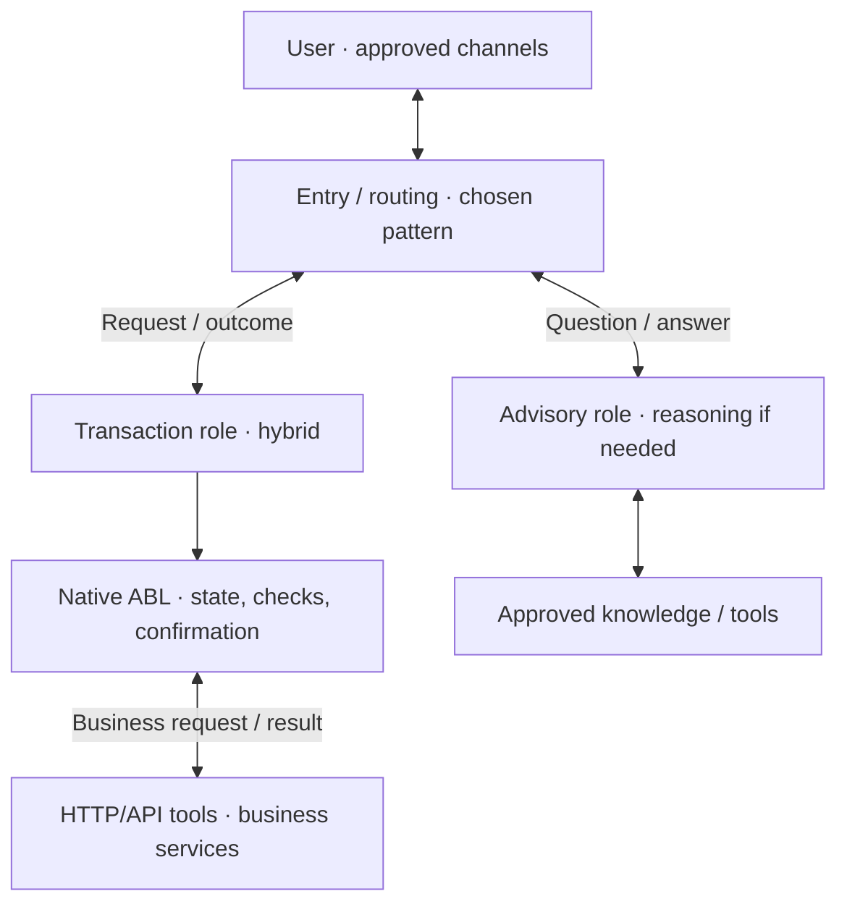

# Architecture Brief — <Agent Project>

<!-- Output template. Keep the filled brief to roughly one–two pages: 500–800 words at most, one readable diagram and a compact decision table. Replace placeholders; omit unused rows. Link details instead of appending full designs. -->

**Revision / status:** <revision> · Proposed / Confirmed

**Scope:** <use cases, channels and first implementation slice>

**Design sources:** <links to separate functional/experience and technical designs>

## Proposed direction

<Two or three sentences explaining the intended outcome, overall architecture and why it fits. State material assumptions.>

## Agent relationships

<!-- Replace this illustrative graph with the actual proposal. Choose and label the supported routing/orchestration pattern; do not instantiate every example role automatically. Show returns and shared dependencies clearly. -->

<One sentence on shared state, handoff/return ownership and any grouped agents.>

| Use case / agent role | Execution choice and reason | Tools / key boundary |
|---|---|---|
| <UC / owner> | <Hybrid: predictable steps with flexible collection/recovery> | <Native ABL controls; HTTP/API action> |
| <UC / owner, if needed> | <Reasoning: specific interpretation/planning need> | <Bounded tools and explicit completion> |

## Tool and experience choices

- **Logic and integrations:** <What stays in native ABL, what uses HTTP/API tools and where backend authority remains.>
- **Code Tool exception:** <None, or the required behavior, native alternatives checked, evidence of the gap and the proposed narrow exception.>
- **Speed and experience:** <How unnecessary calls/handoffs/turns are reduced while preserving useful answers, natural pacing, necessary confirmations and recovery. Identify expected tradeoffs as unmeasured until tested.>
- **Validation:** <Meaningful-response/task targets, success/recovery checks, permitted API effects and conversation/turn/time limits; actual chat/voice evidence planned or unavailable.>

## Confirmation and next step

**First increment:** <Foundation and first complete use case; following use cases in brief.>

**Decisions needed:** <Only material unresolved architecture/scope choices.>

**Confirmation requested:** <Confirm this direction and named implementation scope, or specify changes.>

**Decision record:** <Confirmed revision, user response/date and conditions; leave Proposed until confirmed. Existing explicit approval of the same concrete direction/scope may be referenced.>
